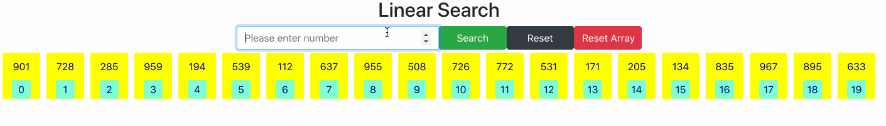
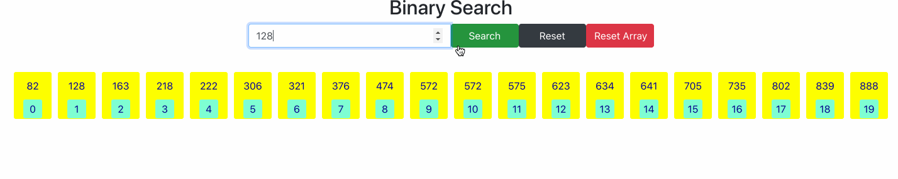
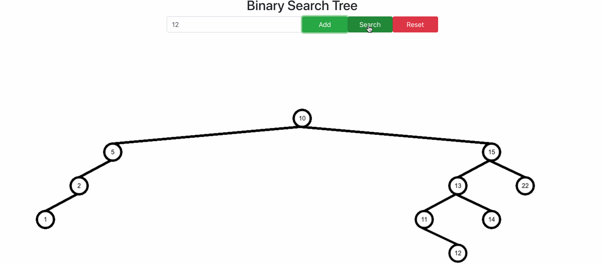

## Visualisation of Famous Algorithms 📊 
This repository implements following algorithms:

### `Linear Search`

### `Binary Search`

### `Binary Search Tree(BST)`
**Note: BST is constructed via Node value inputs from the user!**

### `How to run this project ? 🏃‍♂️`

-   You should have NodeJS insalled in your localhost machine [Download NodeJS](https://nodejs.org/en/)
-   Open Terminal
-   Navigate to Project Directory
-   Hit`npm install`; This will install all required dependencies 
-   After completion of above command, hit `npm start`
-   Wait for it to compile
-   Open [http://localhost:3000](http://localhost:3000) to view it in the browser.
-   Enjoy the visualiser!

### `Contributions.`
Please feel free to fork, improve, make pull requests or fill issues. I'll be glad to fix bugs you encountered.